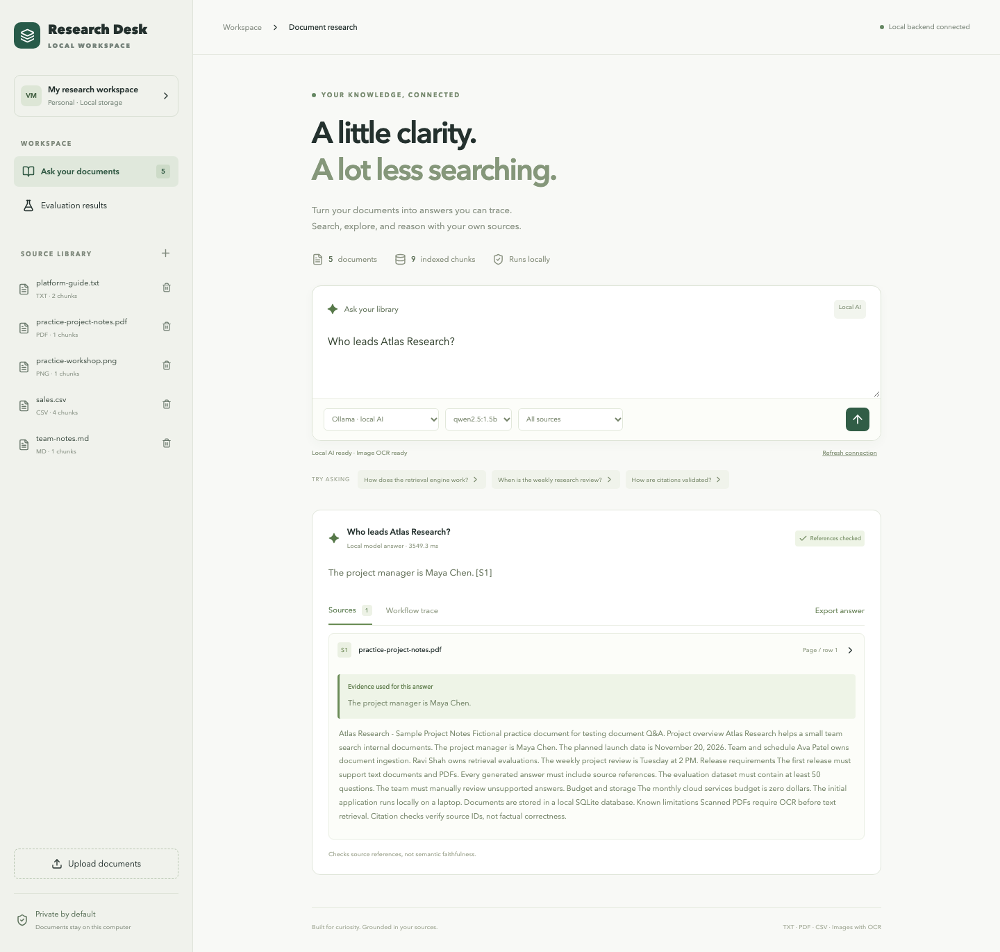
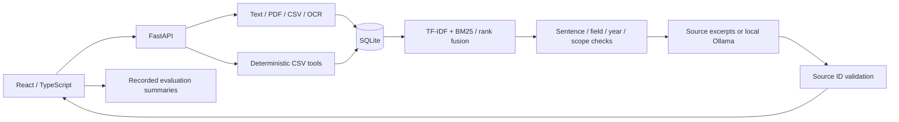

# Local Research Desk

A local portfolio application for researching text, PDFs, CSVs, and text-containing images. Python/FastAPI, React/TypeScript, SQLite, Tesseract OCR, and optional Ollama generation. No paid API key or cloud account is required.



## Start

```bash
./scripts/start.sh
```

Open **http://127.0.0.1:8000**. Keep the terminal running; Ctrl+C stops this session. Startup builds the frontend and starts an installed Ollama server if one is not already running. It never downloads a model automatically. An existing model server is reused; the script stops only a model server it started itself.

On a fresh checkout, install Python 3.9–3.12 (3.11 recommended) and Node.js 22.12+ first. Startup selects a supported installed Python interpreter (set `RESEARCH_DESK_PYTHON` to override), creates a virtual environment and installs Python/frontend dependencies when missing. Downloads require internet; local research does not use a paid service.

If the port is occupied, stop the old app with Ctrl+C before restarting to load updates. Or run `RESEARCH_DESK_PORT=8002 ./scripts/start.sh`. For a readiness check: `.venv/bin/python scripts/doctor.py`.

## Explore

- **Ask your documents:** upload files, choose a source or All sources, and ask a question. Source excerpts work without an LLM. Ctrl/Cmd+Enter submits; Export answer downloads Markdown.
- **Local AI:** select Ollama and an installed model. Generated statements have source IDs validated in Python. Full source cards show both the focused evidence and the original chunk.
- **CSV analysis:** select a CSV, choose row count or numeric summary, select a numeric column, and submit a question. Sample revenue is 6600 across four rows, mean 1650.
- **Evaluation results:** inspect recorded baseline/latest metrics and their limits. This dashboard reads saved reports; Refresh does not execute evaluations.

If the library is empty, load the three demo sources. Additional fixtures are `data/practice-project-notes.pdf` and `data/practice-workshop.png`. Upload them to try “Who leads Atlas Research?” and “What is the workshop registration fee?” All sample documents are fictional.

## Local model and OCR setup

Ollama, `qwen2.5:1.5b`, and Tesseract are installed and verified on the development Mac. For a new machine:

```bash
# macOS with Homebrew
brew install ollama tesseract
# Terminal 1
./scripts/start-ollama.sh
# Terminal 2 — one-time model download, about 1 GB
ollama pull qwen2.5:1.5b
./scripts/start.sh
```

The model-server script uses localhost, disables cloud features, and allows one request/model at a time to limit memory pressure. See the [official local-only configuration](https://docs.ollama.com/faq) if you run the desktop Ollama app separately. Research Desk connects only to `127.0.0.1:11434` and rejects explicit cloud model tags; do not use custom model definitions that proxy to external providers. An 8 GB Mac can run this small-model workflow; quality and speed depend on the workload.

OCR currently uses English language data. Images are converted to text, not interpreted by a vision model. Other languages need additional Tesseract data. On Debian/Ubuntu install `tesseract-ocr`. Selectable-text PDFs are supported; encrypted and textless/scanned PDFs are rejected.

## Architecture



Chunks contain up to 180 words with 35-word overlap. CSV rows have row metadata. Reciprocal rank fusion combines TF-IDF and BM25 rankings; a lexical reranker and focused sentence selection reduce irrelevant evidence. Document-title hints and explicit paraphrase aliases cover some known query forms. Field/year checks refuse certain unsupported questions. Three generic project-question forms request clarification when distinct evidence passages conflict. A narrow imperative-pattern filter removes known instruction-like attack sentences.

These are heuristics, not a semantic retrieval model, general entity resolution, or broad injection defense. Citations prove references exist, not that every assertion is true. The query index is rebuilt per request and suits small libraries. Tools are selected explicitly; this is a controlled workflow rather than an autonomous model-action loop.

## Verify

```bash
.venv/bin/python -m pytest backend/tests -q
.venv/bin/python scripts/evaluate_expanded.py
.venv/bin/python scripts/evaluate_expanded.py --mode ollama
.venv/bin/python scripts/compare_evaluations.py
cd frontend
npm run build
npx playwright install chromium
npm run test:e2e
```

Backend tests cover parsing, uploads, storage, citations, tool values, negative evidence, scoping, clarification, evaluation denominators, report summaries, and CSV metadata. Playwright checks document research, evidence inspection, export, CSV controls, the evaluation dashboard, and mobile overflow. Browser tests use `.logs/browser-test.sqlite3`; evaluations use temporary databases. They leave the user library untouched.

Read [recorded results](evals/RESULTS.md), [evaluation methodology](evals/README.md), and the CSV review worksheets. The 62 synthetic questions were authored during development and informed improvements; they are not an independent test. Literal expected-text matching is a proxy, not semantic faithfulness. Latency is complete sequential response time, not TTFT, token throughput, or concurrent capacity. Local Ollama and OCR have been exercised; remote CI and Docker execution have not.

## Data and development

Uploads are limited to 10 MB. Indexed text and parsed CSV rows live in `data/store.sqlite3`; original bytes are not retained. Removing a document deletes active records, not securely erased disk bytes. The server binds to localhost for one user. Use `RESEARCH_DESK_DB=/path/to/test.sqlite3` to isolate development storage.

```bash
# Backend terminal
.venv/bin/python -m uvicorn backend.app.main:app --reload --host 127.0.0.1 --port 8000
# Frontend terminal
cd frontend
npm run dev
```

Development UI: http://127.0.0.1:5173. API docs: http://127.0.0.1:8000/docs. Main endpoints: health, documents, ask, demo, CSV column metadata, and evaluation summaries under `/api`.

## Optional Docker

```bash
docker build -t local-research-desk .
docker run --rm -p 127.0.0.1:8000:8000 -v research-data:/app/data local-research-desk
```

The image includes Tesseract. Host Ollama is not reachable at the container's loopback address, so this configuration uses source excerpts. Public hosting needs authentication, isolation, and resource controls; it is outside this local release.

## Portfolio materials

- [Project showcase and resume bullets](SHOWCASE.md)
- [Interview walkthrough and technical Q&A](INTERVIEW_GUIDE.md)
- [Implementation scope and learning guide](PORTFOLIO.md)
- [Validation record](evals/VALIDATION.md)

Build a reviewable source archive with `.venv/bin/python scripts/package.py`. It excludes user databases, local models, dependencies, and logs. This code does not implement CUDA, TensorRT, vLLM, Triton, fine-tuning, LangGraph, FAISS, cloud deployment, or Kubernetes; list only implemented capabilities on your resume.
